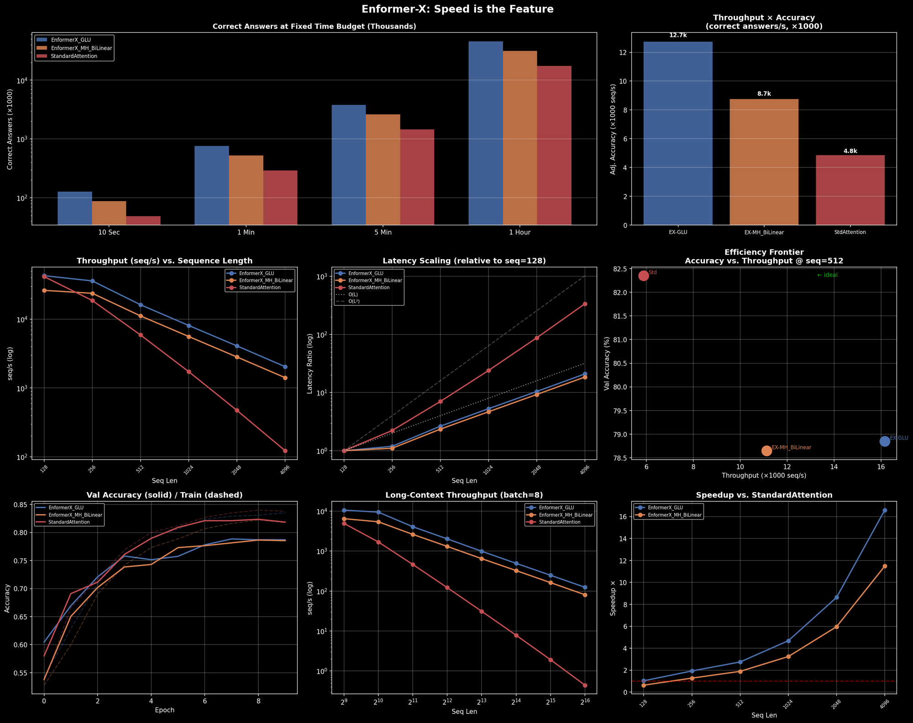

# Forceformer — Throughput-Adjusted Accuracy

**Which model has the highest accuracy?** is the wrong question for
resource-constrained production systems. **Which model delivers the most
correct answers within a fixed time/compute budget?** is the right one.

This repository contains a small, self-contained experiment (`enformer_x_force.ipynb`)
that trains three sequence-mixer architectures on IMDB sentiment classification
and compares them not just on accuracy, but on **throughput × accuracy**
("correct answers per second").

## Models compared

| Model | Mechanism | Complexity |
|---|---|---|
| `EnformerX_GLU` | Element-wise gating (no cross-token mixing) | O(L) |
| `EnformerX_MH_BiLinear` | Multi-head bidirectional linear attention | O(L) |
| `StandardAttention` | Softmax attention (reference) | O(L²) |

All three models share the same parameter count, embedding dimension, training
data, and training schedule. The only difference is the sequence-mixing block.

## What the notebook measures

- **Throughput**: sequences/second at various sequence lengths (128–4096)
- **Throughput-Adjusted Accuracy**: `throughput × accuracy`
- **Budget simulation**: correct answers delivered in 10s / 1min / 5min / 1h
- **Long-context stress test**: throughput and OOM behavior up to seq_len=65536
- **Latency scaling**: empirical O(L) vs. O(L²) behavior

## Headline result (single run, seq_len=512, IMDB, T4 GPU)

| Model | Val. Accuracy | Throughput (seq/s) | Adj. Accuracy |
|---|---|---|---|
| EnformerX_GLU | 78.8% | 16,155 | 12,738 (2.6×) |
| EnformerX_MH_BiLinear | 78.6% | 11,122 | 8,748 (1.8×) |
| StandardAttention | 82.3% | 5,884 | 4,846 (1.0×) |



## ⚠️ Limitations — read before drawing conclusions

This is an exploratory prototype, **not** a rigorous benchmark. Known
limitations of the current results:

- **Single run, no error bars.** Accuracy is the best validation score across
  10 epochs on a 2,000-example validation split — not a held-out test set,
  and not averaged over multiple seeds.
- **Throughput is measured on synthetic tensors**, not full end-to-end
  inference (tokenization + embedding lookup are excluded).
- **Long-context runs (up to 65,536 tokens) only test that the models don't
  crash.** The models were trained at max_len=512; running them at longer
  lengths says nothing about their accuracy there.
- **`EnformerX_GLU` performs no cross-token mixing at all** — it's a purely
  element-wise gated MLP. Framing it as comparable to attention-based global
  context should be read with that caveat in mind.
- **The "Performer" example numbers in the notebook intro are illustrative**,
  not measured in this experiment.

Treat the numbers here as a starting point for discussion and further
experimentation, not as proof that any one architecture is generally
superior.

## Getting started

```bash
pip install -r requirements.txt
jupyter notebook enformer_x_force.ipynb
```

A CUDA-capable GPU is recommended (the notebook was developed on a Tesla T4).
It will also run on CPU, but the long-context stress test will be very slow.

## Reproduction follow-up

The separate [`experiments/forceformer-repro`](experiments/forceformer-repro/) folder contains a
CPU-oriented reproduction on NLTK's small `movie_reviews` corpus, plus exploratory cascade and
sparse-routing experiments. It documents the changed dataset/hardware and limitations; its results
are not directly comparable to the IMDB/T4 notebook above.

## License

Apache License 2.0 — see [LICENSE](LICENSE).
